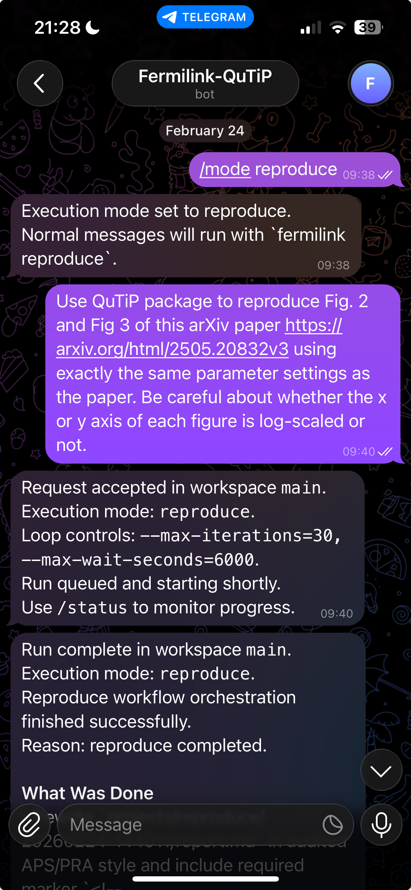
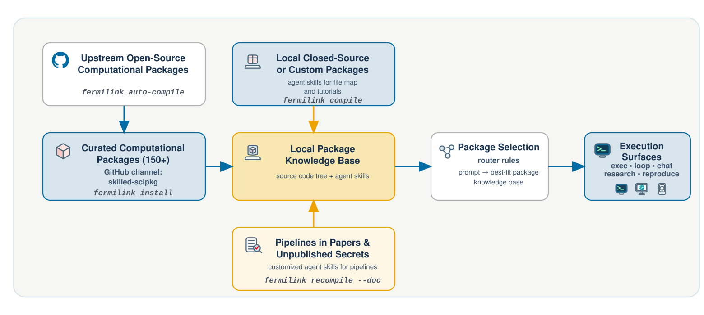
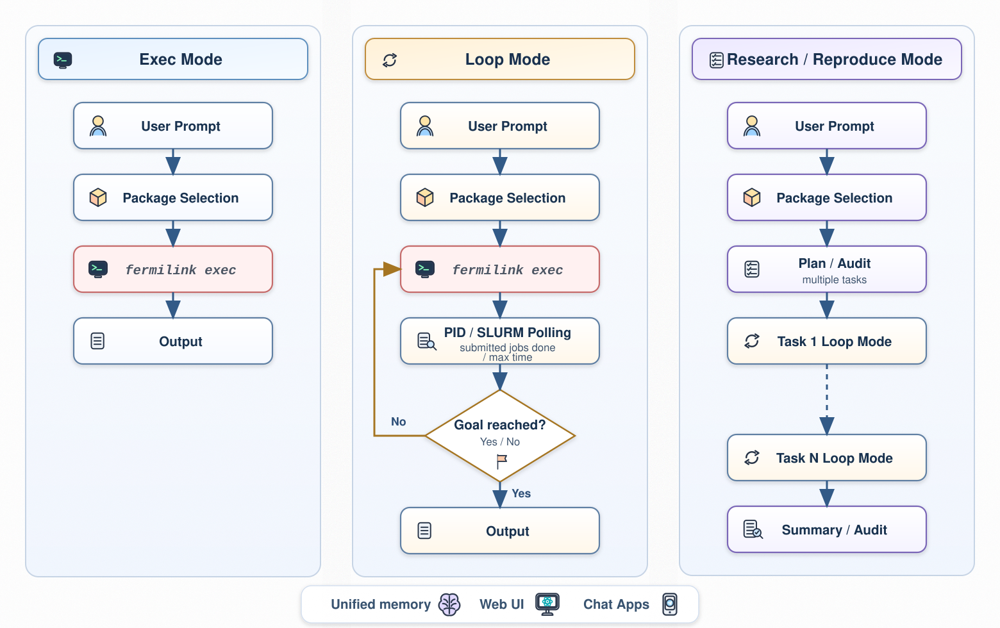

<p align="center">
  
</p>

<p align="center">
  <a href="docs/source/overview.rst"></a>
  <a href="LICENSE"></a>
  
</p>

# FermiLink: AI Agent for Autonomous Scientific Simulations

[**FermiLink**](https://taoeli.github.io/FermiLink/) is a unified agent framework for multidomain autonomous scientific simulations. It runs on personal laptops, **high-performance computing (HPC) clusters**, or even your cellphone. You can interact with it through **command-line tools**, a **web UI** with a ChatGPT-like chat interface, or a **Telegram bot** for on-the-go access.


With [an official package channel](https://github.com/orgs/skilled-scipkg/repositories), **FermiLink** ships with built-in support for more than 150 scientific packages. You can also use its command-line tools to build a local knowledge base from any local scientific package or simulation pipeline.

Once you describe a goal, **FermiLink** takes care of the rest — routing tasks to the right packages, running multi-step simulations, and iterating autonomously on both workstations and **HPC clusters**. It is designed to sustain long-running multi-task computational jobs for days or weeks without human intervention.


## Quick Start
For beginners, start with:

```bash
pip install .
fermilink
```

You can also use the manual workflow directly:

```bash
# 1. Install
pip install .

# 2. Install at least one scientific package knowledge base
fermilink install meep

# 3. set up the agent provider 
fermilink agent codex/claude/gemini

# 4.1. Use command-line tool to do autonomous scientific research
fermilink exec/loop/reproduce/research goal.md

# 4.2. Start web UI service for ChatGPT-like experience
fermilink start

# 4.3. Start the gateway for supporting Chatbots via Telegram
export FERMILINK_GATEWAY_TELEGRAM_TOKEN="<token-from-@BotFather>"
export FERMILINK_GATEWAY_TELEGRAM_ALLOW_FROM="<numeric-id-from-@get_telegram_id_smppcenter_bot>"
fermilink gateway
```

<p align="center">
  
</p>

## Documentation

Visit the [documentation](https://taoeli.github.io/FermiLink/) for installation details and usage guide. 

In brief, the key design principle of **FermiLink** is the separation of package knowledge bases from simulation workflows, so that simulation workflows in **FermiLink**, from figure-level simulations to full-paper-level research on high-performance computing clusters, operate uniformly among supported packages via a four-layer progressive disclosure mechanism.


To accommodate simulations at different scopes, as demonstrated below, **FermiLink** delivers with three major computational workflows. 

- **exec** mode: Designed for short-duration simulations.
- **loop** mode: Connects iterative agent reasoning with simulation monitoring for PID and HPC SLURM jobs, thus providing robust support for long-duration simulations on both workstations and HPC clusters. 
- **research**/**reproduce** mode: Intended for multi-task simulations at the scope of a full research paper. 


## Citation

If you find **FermiLink** helpful for your research, please cite the following reference:

- Gang Meng†, Andres Felipe Bocanegra Vargas†, Xinwei Ji†, Federico Garcia-Gaitan, Felipe Reyes-Osorio, Jalil Varela-Manjarres, Yafei Ren, Mohammadhasan Dinpajooh, Branislav K. Nikolić, Tao E. Li. *FermiLink: A Unified Agent Framework for Multidomain Autonomous Scientific Simulations*. **Submitted to arXiv** (2026).
