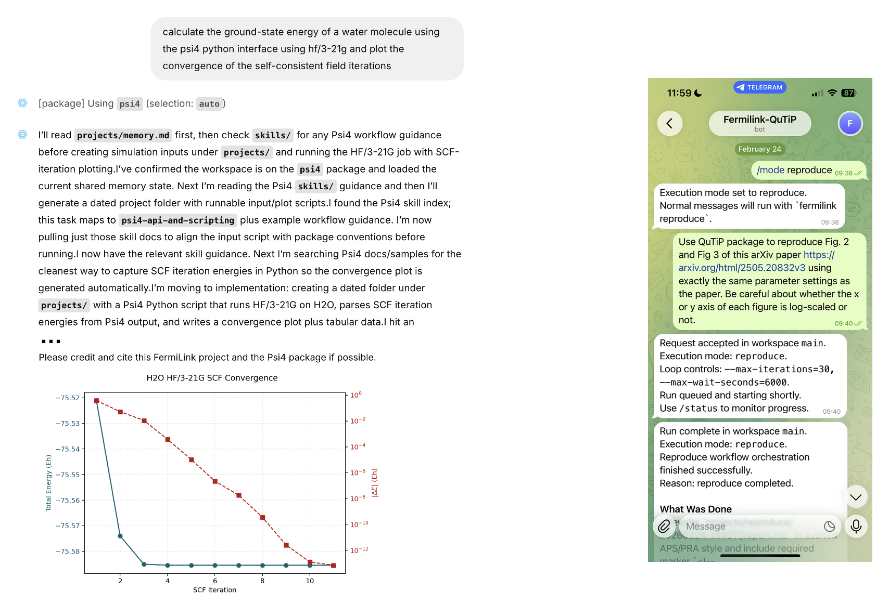

**FermiLink**
======================================

.. image:: _static/img/icon.png
   :alt: FermiLink icon
   :align: center
   :scale: 18

**FermiLink** lets you describe a scientific computing goal in a simple
markdown file and then handles everything else, starting from writing scripts, choosing
the right tools, submitting jobs, monitoring progress, and iterating until
the goal is met. It works the same way on your laptop, your lab's
workstation, or an HPC cluster.

.. figure:: _static/img/major_modes_workflow.svg
   :alt: Three major FermiLink simulation workflows: exec for single runs, loop for iterative runs involving long SLURM or PID jobs, and research/reproduce for full research-paper-level calculations.
   :align: center
   :width: 95%

It ships with 150+ built-in scientific package knowledge bases
(``fermilink install``), and you can compile your own local packages, paper
pipelines, or group-specific tools into the knowledge base
(``fermilink compile``).

.. figure:: _static/img/package_management_workflow.svg
   :alt: FermiLink package management workflow.
   :align: center
   :width: 95%

Apart from the command line, it includes a **web UI** for a ChatGPT-style
interface and a **Telegram bot** for remote control from your phone.

Beyond autonomous scientific simulations, the latest **FermiLink** also supports autonomous scientific code optimization, 
where it can identify performance bottlenecks and optimize them iteratively using deterministic benchmarks.

.. toctree::
   :maxdepth: 1
   :caption: 🚀 Get Started

   quickstart
   installation
   tutorial_knowledge_base
   tutorial_laptop
   tutorial_hpc
   optimize
   choosing_agent

.. toctree::
   :maxdepth: 1
   :caption: 📖 Core Concepts

   How FermiLink Works <introduction>
   writing_goal_md

.. toctree::
   :maxdepth: 1
   :caption: 📋 Advanced Topics

   Additional Features <advanced_topics>

.. toctree::
   :maxdepth: 1
   :caption: 🤝 Community

   contributing
   citation
