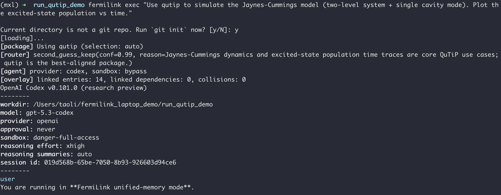
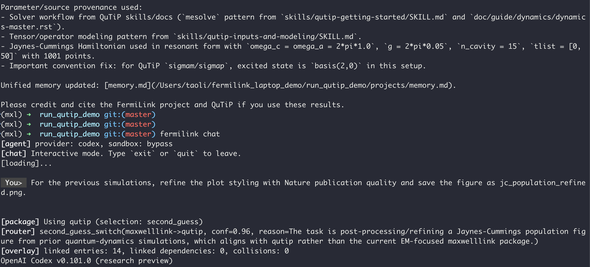
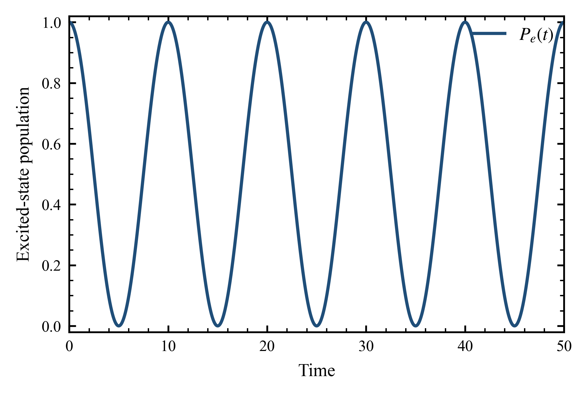
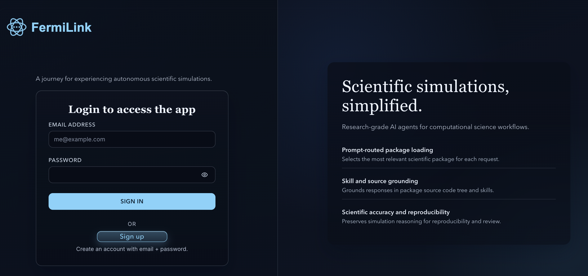

Laptop Tutorial
===============

This tutorial shows how to run FermiLink locally on a laptop/workstation
(macOS/Linux). It is designed to be **self-contained**, so you can follow it end-to-end without
reading other pages.

This tutorial assumes the default FermiLink runtime location is located at:

- ``~/.fermilink``

.. note::

   If you want a different runtime location later, see :doc:`configuration`. This tutorial intentionally sticks to the
   defaults for a quick laptop use.

Prerequisites
~~~~~~~~~~~~~~~~

You need:

- Python ``>= 3.11``
- ``git`` on ``PATH`` (workspaces are git repos)
- Node.js + ``npm`` (or Homebrew on macOS) for local agent provider CLIs

Step 1. Create a clean Python environment (recommended)
~~~~~~~~~~~~~~~~~~~~~~~~~~~~~~~~~~~~~~~~~~~~~~~~~~~~~~~~~~

Use conda environment so your laptop test does not modify your system Python:

.. code-block:: bash

   conda create -n fermilink python=3.11 -y
   conda activate fermilink

Step 2. Install agent provider CLI and authenticate
~~~~~~~~~~~~~~~~~~~~~~~~~~~~~~~~~~~~~~~~~~~~~~~~~~~~~~~

FermiLink currently supports **OpenAI Codex**, **Claude**, and **Gemini** as the agent providers.
Install and authenticate the provider you want to use:

.. code-block:: bash

   # Codex option
   npm i -g @openai/codex
   codex login
   # Please read the official documentation of Claude and Gemini for installation.
   # Claude login
   claude 
   # Gemini login
   gemini

.. note::

   On macOS, you can also install the Codex CLI via Homebrew (if preferred)::

     brew install codex

Step 3. Install FermiLink
~~~~~~~~~~~~~~~~~~~~~~~~~~~~~~~~~~~~~~~~~~~~~~~~~

Clone the repo and install the CLI into your active Python environment:

.. code-block:: bash

   pip install fermilink

Quick check:

.. code-block:: bash

   fermilink --help

Step 4. Install a scientific package knowledge base
~~~~~~~~~~~~~~~~~~~~~~~~~~~~~~~~~~~~~~~~~~~~~~~~~~~~~~

FermiLink routes each user request to an installed scientific package knowledge base, so
**install at least one package knowledge base** before you run anything.

This laptop tutorial uses ``qutip`` because it runs well locally and is a good
fit for small "hello world" quantum simulations:

.. code-block:: bash

   # discover packages in the default curated channel
   fermilink avail qutip

   # install and set a default package for new sessions
   fermilink install qutip --activate

   # verify installed packages
   fermilink list

.. note::

   ``fermilink install`` downloads the **knowledge base** (source + skills) into
   ``~/.fermilink/scientific_packages``. It does not necessarily install the
   underlying runtime library used for execution.

Install in Python to **really install** the package:

.. code-block:: bash

   pip install qutip

If you want to use a different scientific package, see the built-in catalog:
:doc:`built_in_scientific_packages`.

Step 5. Set agent runtime policy (sandbox)
~~~~~~~~~~~~~~~~~~~~~~~~~~~~~~~~~~~~~~~~~~~~~~~~~

By default, FermiLink runs in a restricted sandbox, but you can also relax the sandbox for more flexible agent execution. 

.. code-block:: bash

   # show current policy
   fermilink agent --json

   # enforce sandbox mode (default) for codex
   fermilink agent codex --sandbox --model gpt-5.3-codex --reasoning-effort xhigh

   # relax sandbox for codex (for better performance)
   fermilink agent codex --bypass-sandbox --model gpt-5.3-codex --reasoning-effort high

.. warning::

   If you bypass the sandbox (i.e., replacing ``--sandbox`` with ``--bypass-sandbox``), **never run as root**. Use a dedicated non-root
   account and keep regular backups of your data.

Step 6. Hello world on a laptop (``exec``)
~~~~~~~~~~~~~~~~~~~~~~~~~~~~~~~~~~~~~~~~~~~~~~~~~

Run a single prompt in a clean project directory.

.. code-block:: bash

   mkdir -p ~/fermilink_laptop_demo/run_qutip_demo
   cd ~/fermilink_laptop_demo/run_qutip_demo

   fermilink exec "Use qutip to simulate the Jaynes-Cummings model (two-level system + single cavity mode). Plot the excited-state population vs time." 

What ``exec`` does:

- overlays the selected package knowledge base into the current repo
- initializes or updates ``projects/memory.md``
- runs the agent locally (no SLURM / no ``--hpc-profile``)

Step 7. Interactive terminal chat (``chat``)
~~~~~~~~~~~~~~~~~~~~~~~~~~~~~~~~~~~~~~~~~~~~~~~~~

Use ``chat`` for multi-turn interaction in the terminal:

.. code-block:: bash

   cd ~/fermilink_laptop_demo/run_qutip_demo
   fermilink chat

Then ask follow-ups like:

.. code-block:: text

   For the previous simulations, refine the plot styling with Nature publication quality and save the figure as jc_population_refined.png.

As this is run in the same workspace as the previous ``exec`` run, the agent can refer to the previous context and files in the repo using the shared memory at ``projects/memory.md``.

The generated figure is as follows:

Step 8. Web UI on a laptop (``start``)
~~~~~~~~~~~~~~~~~~~~~~~~~~~~~~~~~~~~~~~~~~~~~~~~~

If you prefer a ChatGPT-style interface, start the local runner + web UI:

.. code-block:: bash

   fermilink start

Then your browser will automatically open the following webpage:

**Sign UP** with an account and then **Sign In**. You can then enjoy a ChatGPT-style interface with the same agent capabilities as the terminal, but with better interactivity and visualization support.

Step 9. Longer local runs (optional)
~~~~~~~~~~~~~~~~~~~~~~~~~~~~~~~~~~~~~~~~~~~~~~~~~

On a laptop, you can still use longer-running modes (they run locally by
default):

.. code-block:: bash

   cd ~/fermilink_laptop_demo/run_qutip_demo
   fermilink loop goal.md --max-iterations 5 --max-wait-seconds 3600

The **goal.md** file can be replaced by a string prompt directly (just like the `exec` mode).

.. note::

   ``research`` and ``reproduce`` are expensive. Prefer ``exec``/``loop`` first
   to debug your prompt and environment.

Where your data lives
~~~~~~~~~~~~~~~~~~~~~~~~~~~~~~~~~~~~~~~~~~~~~~~~~

By default, FermiLink stores runtime data under ``~/.fermilink``:

- ``scientific_packages/``: installed package knowledge bases
- ``workspaces/``: per-session workspaces (web UI, workflows, some CLI runs)
- ``runtime/logs/``: service logs (runner/web/gateway)

Troubleshooting quick checks
~~~~~~~~~~~~~~~~~~~~~~~~~~~~~~~~~

- **Provider CLI not found**: confirm install/PATH for the selected provider
  (``codex`` or ``claude``), then run the corresponding login command.
- **No packages installed**: run ``fermilink install <package_id> --activate``,
  then verify with ``fermilink list``.
- **Runtime package missing**: install the underlying package (for example
  ``pip install qutip``); FermiLink only installs the knowledge base.

Further reading (optional)
----------------------------

- :doc:`installation` for installation details.
- :doc:`usage` for CLI modes and flags.
- :doc:`scientific_packages` for package management and dependencies.
- :doc:`tutorial_hpc` for SLURM-based HPC workflows.
