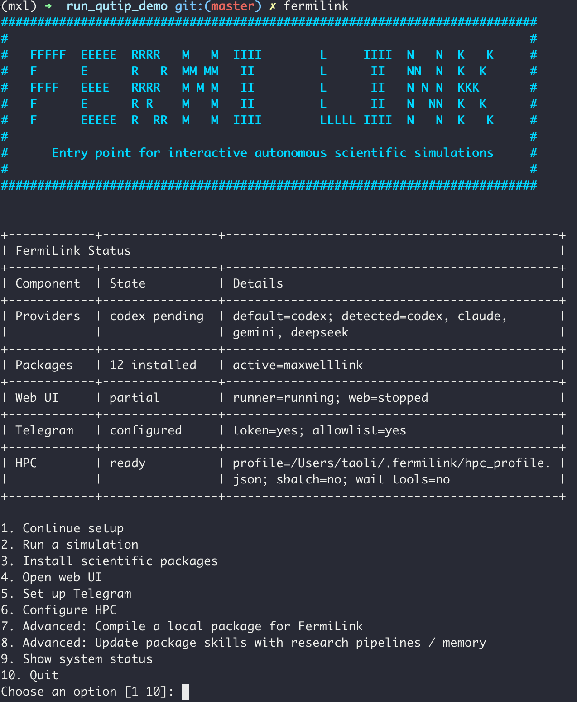

Command Line Tools
==================

The most powerful way to use FermiLink is through the **command line interface (CLI)**, which provides direct access to all features and is the primary interface for advanced users. 
Below is a comprehensive reference for using the CLI effectively.

Beginner entrypoint
-------------------

In an interactive terminal, running ``fermilink`` with **no subcommand**
launches a deterministic onboarding assistant. 

As shown above, the assistant provides a structured status summary and menu to guide users through setup, package installation, web UI startup, Telegram gateway setup, or a guided simulation launch. 

It also checks for provider CLI authentication, installed scientific packages, and an optional default HPC profile.

Below are the detailed instructions for the three major workflows of FermiLink: ``exec`` for single runs, ``loop`` for iterative runs involving long SLURM or PID jobs, and ``research/reproduce`` for full research-paper-level calculations.

.. figure:: _static/img/major_modes_workflow.svg
   :alt: Three major FermiLink workflows: exec for single runs, loop for iterative runs involving long SLURM or PID jobs, and research/reproduce for full research-paper-level calculations.
   :align: center
   :width: 95%

``exec``: One-shot execution in the current repo
---------------------------------------------------

Use ``exec`` when you want one prompt & one run followed by package routing in
your current working directory. This is the most direct way to use FermiLink and is well suited for tasks that complete within about 30 minutes.

.. code-block:: bash

   fermilink exec "run a single-mode cavity coupled to a weakly excited two-level system and plot the population dynamics"

   # provide prompt from a file
   fermilink exec goal.md

   # run with an HPC profile appended to the prompt context
   fermilink exec goal.md --hpc-profile hpc_profile.json

What ``exec`` does:

- routes the prompt to the best installed package (keyword router + optional agent second-guess);
- overlays the selected package knowledge base into the current repository;
- syncs the unified ``AGENTS.md`` instructions to the current workspace;
- initializes/upgrades shared memory at ``projects/memory.md``;
- runs provider execution and streams output;
- after ``exec`` finishes, attempts a best-effort repository checkpoint commit
  (``git add -A`` + conditional commit).

Useful flags:

- ``--package <id>``: pin a package id (skip routing).
- ``--sandbox <mode>``: apply a per-run sandbox override.
- ``--hpc-profile <json>``: append workflow-style HPC constraints to the prompt.
- ``--init-git``: initialize a git repo non-interactively if missing.
- ``--no-init-git``: fail if a git repo is missing.

HPC default settings
~~~~~~~~~~~~~~~~~~~~~~

If ``--hpc-profile hpc_profile.json`` is provided for ``fermilink exec/loop/research/reproduce``, FermiLink will use the specified HPC profile to submit and monitor SLURM jobs. Otherwise, it will run all tasks locally using PID controls for waiting and iteration.

A sample HPC profile (``hpc_profile.json``) looks like this:

.. code-block:: json

   {
      "slurm_default_partition": "shared",
      "slurm_defaults": "--nodes=1 --ntasks=1 --ntasks-per-node=1 --cpus-per-task=1 --time=24:00:00",
      "slurm_resource_policy": "Use serial/single-node defaults unless the method explicitly requires MPI or multi-node scaling"
   }

``chat``:  Interactive terminal chat
--------------------------------------

Use ``chat`` for multi-turn conversation in the terminal. It works like the web UI but runs entirely in the terminal, with live provider output visible at each turn.

.. code-block:: bash

   fermilink chat

Per turn, ``chat``:

- re-runs package routing and may switch packages when needed;
- overlays package content into the current repository;
- initializes/upgrades shared memory at ``projects/memory.md``;
- streams provider stdout/stderr live;
- appends the assistant reply to session history.

Useful flags:

- ``--package <id>``: pin a package for the whole session.
- ``--sandbox <mode>``: enforce sandbox mode for this session.
- ``--init-git`` / ``--no-init-git``: same behavior as ``exec``.

.. note:: 

   The chat mode does not support ``--hpc-profile`` flag, so it will run all tasks locally if the user does not specify HPC requirements. For HPC runs, it is recommended to use the ``exec`` or ``loop`` modes with the appropriate HPC profile.

``loop``: Autonomous iterative loop
------------------------------------

Use ``loop`` for iterative autonomous work with persistent memory and job-aware
waiting.

.. code-block:: bash

   fermilink loop prompt.md
   fermilink loop "Run a few simulations regarding strong coupling with a single two-level system and a cavity mode."

   # cap iterations and max wait time for PID/SLURM job polling
   fermilink loop --max-iterations 10 --max-wait-seconds 3600  prompt.md

   # append an HPC target profile to the loop prompt context
   fermilink loop --hpc-profile hpc_profile.json prompt.md

Loop behavior:

- iterates until done token or iteration cap;
- persists unified memory to ``projects/memory.md`` (short-term plan/progress + long-term durable outcomes);
- streams provider output live each iteration;
- stops early when output includes ``<promise>DONE</promise>``;
- supports job-aware waiting via ``<pid_number>...</pid_number>`` and
  ``<slurm_job_number>...</slurm_job_number>`` tags and polls until completion
  (bounded by ``--max-wait-seconds``);
- after ``loop`` finishes, attempts a best-effort repository checkpoint commit
  (``git add -A`` + conditional commit).

``reproduce``: Reproduce workflows
-----------------------------------

Use ``reproduce`` to orchestrate planner/auditor + multi-task loop runs + summary/auditor for
publication-scale reproduction requests.

.. code-block:: bash

   fermilink reproduce paper.tex
   fermilink reproduce "reproduce Figures 1-4 from this paper arXiv:..."

   # provide the plan for review without execution, user can modify the generated plan before execution
   fermilink reproduce paper.tex --plan-only

   # provide the report for review only without planning and execution
   fermilink reproduce paper.tex --report-only

   # append an HPC target profile to the reproduce prompt context
   fermilink reproduce paper.tex --hpc-profile hpc_profile.json

Key artifacts are written under ``projects/reproduce/<run-id>/`` (for example
``plan.json``, ``state.json``, prompts, logs, and ``report.md``).

Notes:

- At workflow entry (except ``--report-only``), ``reproduce`` resets only the
  short-term memory section while preserving long-term memory content.
- Each ``reproduce`` task run records the nested ``loop`` completion checkpoint
  outcome in its task log using the same best-effort repository commit helper as
  other FermiLink modes.
- When the ``reproduce`` command finishes, it also attempts a best-effort
  completion checkpoint commit in the repository.
- The workflow generates orchestration scripts (for example ``00_run_all.sh``)
  under the run directory to support reruns and staged execution.
- Use ``--hpc-profile <json>`` to enforce an HPC SLURM target profile.

.. note:: 
   
   Because FermiLink supports a unified memory model across workflows, users can start with

   .. code-block:: bash
      
      fermilink reproduce paper.tex --plan-only
   
   to generate a plan at ``projects/reproduce/<run-id>/plan.json``. Users can then modify the plan accordingly and run the full workflow with 

   .. code-block:: bash
      
      fermilink reproduce paper.tex
   
   The second one will **automatically skip the planning stage and start execution with the modified plan.** This allows users to have more control over the workflow and make adjustments before running any simulations.

   Note that **if a different prompt or file is provided in the second command, it will trigger a new planning stage.**

``research``: Research workflows
---------------------------------

Use ``research`` when starting from an idea prompt instead of an existing paper.

.. code-block:: bash

   fermilink research "Design and validate a cavity QED protocol"
   fermilink research idea.md

   # provide the plan for review without execution, user can modify the generated plan before execution
   fermilink research idea.md --plan-only

   # provide the report for review only without planning and execution
   fermilink research idea.md --report-only

   # append an HPC target profile to the reproduce prompt context
   fermilink research idea.md --hpc-profile hpc_profile.json

Key artifacts are written under ``projects/research/<run-id>/`` (including
``report.md`` and ``report.pdf`` if latex is available).

Notes:

- Like ``reproduce``, ``research`` resets only short-term memory at workflow
  entry (except ``--report-only``) and preserves long-term memory.
- Each ``research`` task run records the nested ``loop`` completion checkpoint
  outcome in its task log using the same best-effort repository commit helper as
  other FermiLink modes.
- When the ``research`` command finishes, it also attempts a best-effort
  completion checkpoint commit in the repository.
- ``--report-only`` skips planning/task execution and runs only report
  finalization from the saved run context.
- Use ``--hpc-profile <json>`` to enforce an HPC SLURM target profile.

.. note:: 
   
   Because FermiLink supports a unified memory model across workflows, users can start with

   .. code-block:: bash
      
      fermilink research idea.md --plan-only
   
   to generate a plan at ``projects/research/<run-id>/plan.json``. Users can then modify the plan accordingly and run the full workflow with 

   .. code-block:: bash
      
      fermilink research idea.md
   
   The second one will **automatically skip the planning stage and start execution with the modified plan.** This allows users to have more control over the workflow and make adjustments before running any simulations.

   Note that **if a different prompt or file is provided in the second command, it will trigger a new planning stage.**

Global agent runtime policy
---------------------------

Use ``fermilink agent`` to set global runtime defaults used by
``exec/chat/loop/research/reproduce`` and the web runner path.

.. code-block:: bash

   # check current agent runtime policy
   fermilink agent --json
   
   # set Codex as the default provider with sandbox mode and extra reasoning effort
   fermilink agent codex --sandbox --model gpt-5.3-codex --reasoning-effort xhigh

   # set Claude with relaxed sandbox for better performance
   fermilink agent claude --bypass-sandbox --model sonnet --reasoning-effort high

   # set Gemini with sandbox for better safety
   fermilink agent gemini --sandbox --model auto-gemini-3 --reasoning-effort high

   # clear provider/model override and reasoning effort settings 
   # so FermiLink will use the default provider/model and reasoning effort
   fermilink agent --clear-model
   fermilink agent --clear-reasoning-effort

See also
--------

- :doc:`installation` for initial setup (provider auth for Codex/Claude/Gemini, first package install).
- :doc:`configuration` for runtime variables and provider/sandbox policy.
- :doc:`architecture` for the request flow and streaming contracts.
- :doc:`scientific_packages` for install/compile/recompile workflows.
